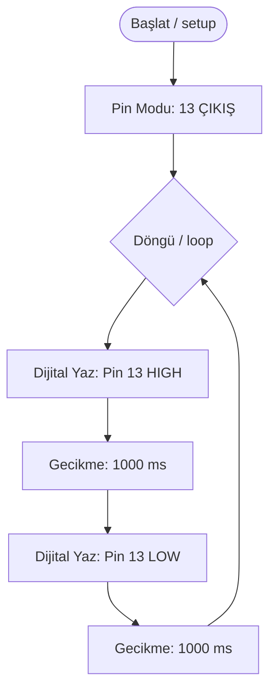

# Flowide &mdash; Modern &amp; Görsel Arduino IDE

<p align="center">
  <strong>Görsel mantık bloklarını sürükleyip bağlayın, standart C++ kodunu anında derleyin ve Web Serial API ile doğrudan USB üzerinden Arduino'nuza aktarın.</strong>
</p>

<p align="center">
  
  
  
  
  
</p>

---

##  İçindekiler

1. [Genel Bakış](#-genel-bakış)
2. [Öne Çıkan Yetenekler](#-öne-çıkan-yetenekler)
3. [Yazılım &amp; Derleyici Mimarisi](#-yazılım--derleyici-mimarisi)
4. [Desteklenen Bloklar ve Modüller](#-desteklenen-bloklar-ve-modüller)
5. [40+ Hazır Proje Kütüphanesi](#-40-hazır-proje-kütüphanesi)
6. [Web Serial ile USB Doğrudan Yükleme](#-web-serial-ile-usb-doğrudan-yükleme)
7. [Temel Elektronik ve Formül Kılavuzu](#-temel-elektronik-ve-formül-kılavuzu)
8. [Kurulum ve Yerel Çalıştırma](#-kurulum-ve-yerel-çalıştırma)
9. [Akademik Atıf &amp; Kaynakça](#-akademik-atıf--kaynakça)
10. [Lisans](#-lisans)

---

##  Genel Bakış

**Flowide**, gömülü sistemler ve Arduino programlamayı basitleştiren, tarayıcı tabanlı görsel bir tümleşik geliştirme ortamıdır (IDE). Karmaşık C++ sözdizimi yerine akış tabanlı blok bağlantıları kullanarak:

- **Sıfır Kurulum:** Ek bir yazılım, derleyici veya sürücü indirmeden Chrome/Edge tarayıcısında anında çalışır.
- **Canlı C++ Üretimi:** Blokları bağladığınız veya parametreleri değiştirdiğiniz anda endüstri standardı Arduino C++ kodunu üretir.
- **Doğrudan Seri İletişim:** Web Serial API sayesinde USB portundaki fiziksel karta bağlanıp seri monitör çıktısını gerçek zamanlı okur ve komut gönderir.
- **Dahili Arduino Asistanı:** Doğal dilde devre ve kod sorularınızı yanıtlar; tek tıkla şemayı çalışma alanına yükler.

---

##  Öne Çıkan Yetenekler

```
+-------------------------------------------------------------------------------+
|                                FLOWIDE MİMARİSİ                               |
+-------------------------------------------------------------------------------+
|  +---------------------+   +---------------------+   +---------------------+  |
|  |   Görsel Bloklar    |-->| Topolojik AST Graf  |-->| Standart Arduino    |  |
|  | (Kinetik UI & Port) |   |    (Lexer/Parser)   |   | C++ Kaynak Kodu     |  |
|  +---------------------+   +---------------------+   +---------------------+  |
|             |                         |                         |             |
|             v                         v                         v             |
|  +---------------------+   +---------------------+   +---------------------+  |
|  |   Sanal Simülatör   |   |   Web Serial API    |   | .ino & .json Proje  |  |
|  | (Canlı Pin & Zaman) |   |  (USB Port Bağlantı)|   |    (Çift Yönlü İçe) |  |
|  +---------------------+   +---------------------+   +---------------------+  |
+-------------------------------------------------------------------------------+
```

| Modül | Açıklama | Teknik Detay |
| :--- | :--- | :--- |
| **Topolojik Graf AST** | Blok bağlantılarını hiyerarşik sözdizim ağacına dönüştürür. | İç içe `if-else`, `for`, `while` bloklarını doğru süslü parantez `{}` kapsamıyla oluşturur. |
| **Web Serial API** | Fiziksel USB portuna doğrudan JavaScript üzerinden bağlanır. | Baud rate (9600 - 115200) seçimi, canlı veri akışı ve komut iletimi. |
| **Sanal Simülatör** | Kart olmadan mantık akışını adım adım test eder. | Pin durumları (HIGH/LOW), değişkenler ve sayaçlar gerçek zamanlı güncellenir. |
| **Akıllı Asistan** | 40+ Arduino projesini ve devre şemalarını otomatik eşleştirir. | Proje kodunu tek tıkla çalışma alanındaki bloklara çevirir. |
| **Tam Kapsamlı Dökümanlar** | Sayfa içinde Ohm Kanunu, ADC, PWM ve donanım kılavuzu. | Tek anahtarla doğrudan IDE'ye aktarılabilir kod örnekleri. |

---

##  Yazılım & Derleyici Mimarisi

Flowide, blokları basit bir dizi olarak değil; yönlü bir çizge (Directed Acyclic Graph) olarak ele alır:



1. **Giriş / Çıkış Portları:** Her blok tipine özgü giriş (`in`), çıkış (`next`), doğru (`true`), yanlış (`false`) ve döngü gövdesi (`body`) portları tanımlıdır.
2. **Kablo Çizimi (Bezier Curve):** İki pin arasındaki mesafe ve yön vektörüne göre yumuşak SVG Bezier eğrisi (`M x1 y1 C cx1 cy1, cx2 cy2, x2 y2`) hesaplanır.
3. **AST Traversing:** Başlangıç düğümünden itibaren topolojik derinlik öncelikli arama (DFS) ile bloklar taranır ve C++ kod gövdesi oluşturulur.

---

##  Desteklenen Bloklar ve Modüller

| Kategori | Blok Adı | Açıklama | Üretilen C++ Kodu |
| :--- | :--- | :--- | :--- |
| **Temel** | `Başlat (Start)` | Program giriş noktası | `void setup() { ... } void loop() { ... }` |
| **Giriş / Çıkış** | `Dijital Yaz (Digital Write)` | Pine 5V veya 0V verir | `digitalWrite(pin, HIGH / LOW);` |
| **Giriş / Çıkış** | `Dijital Oku (Digital Read)` | Buton/anahtar okur | `digitalRead(pin);` |
| **Giriş / Çıkış** | `Analog Yaz (PWM)` | 0-255 arası PWM sinyali | `analogWrite(pin, value);` |
| **Giriş / Çıkış** | `Analog Oku (ADC)` | 0-1023 arası voltaj okur | `analogRead(pin);` |
| **Haberleşme** | `Seri Yaz (Serial Print)` | USB Seri porta metin basar | `Serial.println("Mesaj");` |
| **Zamanlama** | `Gecikme (Delay)` | Milisaniye cinsinden duraklar | `delay(ms);` |
| **Mantık & Akış** | `Eğer / İse (If/Else)` | Koşullu dallanma | `if (kosul) { ... } else { ... }` |
| **Döngüler** | `Tekrarla (For Loop)` | Belirli sayıda döner | `for (int i=0; i<N; i++) { ... }` |
| **Motor & Sensör** | `Servo Açısı (Servo Write)` | SG90 servo motor açısı | `myServo.write(aci);` |

---

##  40+ Hazır Proje Kütüphanesi

Flowide içerisinde tek tıkla bloklara dönüştürülebilen 40'tan fazla hazır mühendislik projesi yer almaktadır:

| No | Proje Adı | Kullanılan Donanım | Devre Bağlantısı |
| :---: | :--- | :--- | :--- |
| **01** | Karaşimşek (LED Chaser) | 5x LED, 5x 220&Omega; Direnç | LED'ler Pin 2, 3, 4, 5, 6 &rarr; GND |
| **02** | Ultrasonik Park Sensörü | HC-SR04 Sensör, Buzzer | Trig &rarr; Pin 9, Echo &rarr; Pin 10, Buzzer &rarr; Pin 8 |
| **03** | LDR Işığa Duyarlı Gece Lambası | LDR, 10k&Omega; Direnç, LED | LDR &rarr; A0 (Gerilim bölücü), LED &rarr; Pin 13 |
| **04** | Potansiyometre ile Servo Kontrolü | SG90 Servo Motor, 10k Pot | Pot &rarr; A0, Servo Sinyal &rarr; Pin 9 |
| **05** | Toprak Nem Sulama Sistemi | Nem Sensörü, 5V Röle, Su Pompası | Nem &rarr; A0, Röle Sinyal &rarr; Pin 7 |
| **06** | RGB LED Renk Geçişi | Ortak Katot RGB LED, 3x 220&Omega; | Kırmızı &rarr; Pin 9, Yeşil &rarr; Pin 10, Mavi &rarr; Pin 11 |
| **07** | LCD 1602 I2C Sıcaklık Göstergesi | I2C LCD Ekran, LM35 Sensör | SDA &rarr; A4, SCL &rarr; A5, LM35 &rarr; A0 |
| **08** | DHT11 Dijital Termometre & Nem | DHT11 Sensör, 4.7k Direnç | Data &rarr; Pin 2 |
| **09** | PIR Hareket Dedektörü Alarmı | PIR Sensör, Buzzer, LED | PIR Out &rarr; Pin 2, Buzzer &rarr; Pin 8 |
| **10** | HC-05 Bluetooth Röle Kontrolü | HC-05 BT Modülü, 4'lü Röle | TX &rarr; RX (Pin 0), RX &rarr; TX (Pin 1) |

*(Tam 40+ proje listesi, kaynak kodları ve açıklamaları ana sayfadaki Dökümanlar bölümünde yer almaktadır).*

---

##  Web Serial ile USB Doğrudan Yükleme

Flowide, W3C Web Serial standartlarını destekler. Tarayıcınızdan USB üzerindeki mikrodenetleyiciye doğrudan erişim sağlar:

```
[Tarayıcı / Flowide] --(Web Serial API / USB CDC)--> [CH340 / FTDI / CP2102] --> [ATmega328P]
```

1. **Bağlantı:** Sağ paneldeki **"USB Bağlan"** butonuna tıklayın.
2. **Port Seçimi:** Açılan sistem penceresinde Arduino'nuzun bağlı olduğu COM portunu (veya `/dev/ttyUSB*`) seçip **"Bağlan"**a basın.
3. **Seri Monitör:** Seri port üzerinden gelen sensör verilerini canlı izleyin ve mikrodenetleyiciye komutlar iletin.

---

## 📐 Temel Elektronik ve Formül Kılavuzu

### 1. Ohm Kanunu & LED Direnci
$$R = \frac{V_{kaynak} - V_{led}}{I_{led}}$$
- **Örnek:** 5V Arduino çıkışı ile 2.0V gerilim düşümlü kırmızı LED için 20mA ($0.02A$) akım sınırlama direnci:
$$R = \frac{5V - 2V}{0.02A} = 150\,\Omega \quad (\text{Standart: } 220\,\Omega)$$

### 2. 10-Bit ADC Voltaj Dönüşümü
$$V_{okunan} = \frac{\text{ADC\_Deger} \times 5.0}{1023.0}$$

### 3. PWM (Darbe Genişlik Modülasyonu) Ortalama Çıkış
$$V_{ortalama} = V_{maks} \times \left(\frac{\text{Duty\_Cycle}}{255}\right)$$

---

##  Kurulum ve Yerel Çalıştırma

Flowide sıfır bağımlılıkla saf web standartları (HTML5, CSS3, Vanilla ES6+ JavaScript) üzerinde çalışır:

```bash
# 1. Depoyu klonlayın
git clone https://github.com/abdbali/ide.git

# 2. Proje dizinine girin
cd ide

# 3. index.html dosyasını herhangi bir modern tarayıcıda açın
start index.html
```

---

##  Akademik Atıf & Kaynakça

Flowide mimarisini veya dökümantasyonunu akademik yayınlarınızda kaynak göstermek için:

### BibTeX
```bibtex
@software{bali2026flowide,
  author       = {Bali, Abdurrahman},
  title        = {Flowide: Web Serial Destekli Görsel Arduino IDE ve AST Derleyicisi},
  year         = {2026},
  url          = {https://github.com/abdbali/ide},
  version      = {1.0.7}
}
```

### APA 7th Edition
> Bali, A. (2026). *Flowide: Web Serial Destekli Görsel Arduino IDE ve AST Derleyicisi* (Sürüm 1.0.7) [Bilgisayar Yazılımı]. GitHub. https://github.com/abdbali/ide

---

##  Lisans

Bu proje **MIT Lisansı** ile lisanslanmıştır. Detaylar için [`LICENSE`](LICENSE) dosyasına göz atabilirsiniz.

<p align="center">
  Geliştirici: <strong><a href="https://github.com/abdbali">Abdurrahman Bali (@abdbali)</a></strong> &bull; Sürüm 1.0.7
</p>
